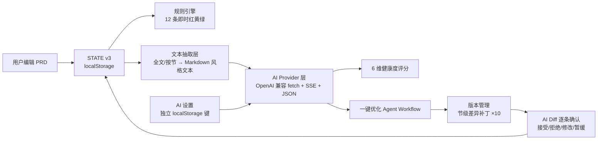
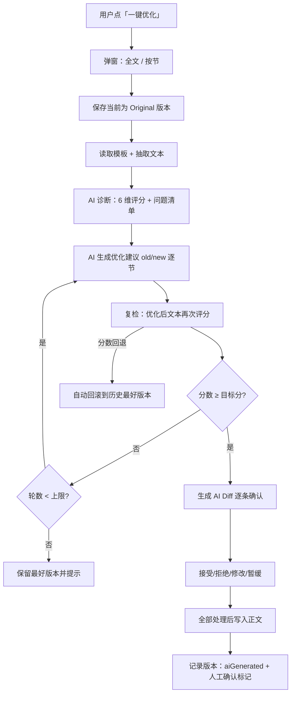

# PRD 智能看板 · AI Agent 功能设计方案（Phase 2）

> 状态：**已实现（v17.0）** · 版本：v1.0 · 日期：2026-08-15
> 配套：`PRD智能看板.html`（v16.9 基线）· 后端路线：**方案 C（纯前端直连，无后端）**

---

## 1. 已确认决策（与需求文档对齐）

| # | 决策 | 内容 |
|---|---|---|
| 1 | 节奏 | 先闭环、后扩展：MVP 只做「配置+Key → 6 维健康度 → 逐条建议确认 → 一键优化 → 版本+Diff」 |
| 2 | 引擎关系 | 现有 12 条规则引擎（红黄绿）**保留为即时基线**，AI 评分作为深度分析面板，两者 UI 并列、不覆盖 |
| 3 | Provider | DeepSeek（默认），Base URL 完全可配置（OpenAI 兼容）；测试连接失败时当场提示（含 CORS 错误） |
| 4 | AI 标识 | UI 与导出**均不显示** AI 标记；内部数据仍记 `aiGenerated` 字段，仅供版本回滚语义使用（**待用户最终确认**） |
| 5 | 评分维度 | 砍到 **6 个**：完整性 / 清晰度 / 一致性 / 可执行性 / 可验证性 / 风险；维度开关与权重配置化，不写死 |
| 6 | 护栏 | 一键优化最多 2–3 轮（可配置）；分数回退自动回滚到历史最好版本；目标分可配置（默认 85） |
| 7 | 优化范围 | 一键优化运行时弹窗，让用户选「全文优化 / 按节优化」 |
| 8 | 后端 | **方案 C**：纯前端直连 DeepSeek，Key 存浏览器 localStorage（独立键），无服务端 |
| 9 | 保留能力 | 忽略/已订正、人工改色、规则导入导出、版本导出全部保留，给人工审核留通道 |
| 10 | 侵入性 | 保持单文件结构；AI 功能以独立 `<script>` 块追加，不重写现有代码 |

---

## 2. 总体架构



要点：

- **单文件不变**：AI 全部逻辑放在新追加的 `<script>` 块（主逻辑 block1 之后、Floating UI/评论控制器附近），通过现有 `STATE` 读写接口交互，不侵入现有函数。
- **存储分层**：
  - `prdKanbanStateV3`（现有）→ 文档主体 + `STATE.ai`（版本元数据、Diff、AI 问题清单、忽略清单）
  - `prdKanbanAiSettings`（**新独立键**）→ Base URL / Model / API Key / 目标分 / 轮数 / 维度配置
  - Key **永不进入 STATE**，**永不随 JSON 备份导出**，**永不写入日志或 prompt**。
- **无外网依赖**：除用户主动发起的 DeepSeek 请求外，页面保持零网络。

---

## 3. AI Provider 层

职责：屏蔽具体服务商差异，只暴露 4 个方法：

```js
aiClient.testConnection(settings)          // 最小请求验证 Key/地址
aiClient.score(docText, template, settings) // 6 维评分，返回 JSON
aiClient.diagnose(docText, template, settings) // 逐条问题诊断
aiClient.optimize(sectionText, template, settings) // 优化建议（old/new）
```

实现要点：

- 请求：`fetch(baseUrl + '/chat/completions')`，OpenAI 兼容格式，`Authorization: Bearer <key>`。
- 流式：`stream: true` + SSE 增量解析，面板实时显示"正在分析…"进度；失败自动降级为非流式重试一次。
- 结构化输出：`response_format: {type:'json_object'}`（DeepSeek 支持），prompt 中同时强制 JSON schema；解析失败重试 1 次，仍失败则给出可读错误。
- 错误分类：CORS / 401（Key 无效）/ 429（限流，退避重试）/ 超时（30s）/ 网络中断，逐类给出中文提示。
- 超长文档：按节抽取（见 §5），单请求文本上限约 12k token；超出先按节处理，二期再上完整分块。

---

## 4. 6 维健康度评分模型

### 4.1 维度定义

| 维度 | 判断要点 | 默认权重 |
|---|---|---|
| 完整性 | 必填节是否存在、关键信息（背景/目标/范围/里程碑）是否齐全 | 25% |
| 清晰度 | 表述是否含糊、术语是否定义、是否有歧义表述 | 20% |
| 一致性 | 前后术语/数字/需求点是否自洽、是否与模板结构一致 | 15% |
| 可执行性 | 需求是否可落地、是否有遗漏实现细节、是否过度抽象 | 15% |
| 可验证性 | 验收标准是否可测、是否有明确成功指标 | 15% |
| 风险 | 依赖、边界、安全、数据风险是否被识别 | 10% |

权重在 AI 设置里可调，总分 = Σ(维度分 × 权重)。

### 4.2 AI 返回结构（JSON）

```json
{
  "summary": "一句话总评",
  "total": 78,
  "dimensions": [
    {
      "id": "completeness",
      "name": "完整性",
      "score": 82,
      "issues": [
        {
          "id": "iss_001",
          "sectionId": "sec_goals",
          "sectionTitle": "项目目标",
          "severity": "high",
          "reason": "目标缺少量化指标",
          "suggestion": "补充可量化的成功指标，如「上线后 30 天内转化率 ≥ 5%」"
        }
      ]
    }
  ]
}
```

### 4.3 与规则引擎的关系

- 规则引擎：即时、免费、离线，秒级出红黄绿，永远可用。
- AI 评分：按需、联网、深度，与规则引擎**并列展示**（同一健康度区域两个来源，互不覆盖）。
- 规则引擎的「黄（疑似缺失）」与 AI 问题清单可互相跳转，但**不合并、不互相改写**。

---

## 5. 文本抽取层

- 从 `STATE` 按现有节结构（标题 + 富文本内容 + 表格 rows）抽取为 Markdown 风格文本。
- 支持两种粒度：`全文`（拼成一整份）与 `按节`（单节文本，用于按节优化）。
- 表格统一转为 Markdown 表格语法，图片/Base64 剥离（只留 `[图]` 占位），控制 token。
- 抽取结果仅用于请求 AI，**不落盘、不进 STATE**。

---

## 6. 一键优化 Agent Workflow



护栏细节：

- 轮数上限：默认 3，可在设置里改（2–5）。
- 每轮复检分数低于历史最好 → **自动回滚到最好版本**，并把该轮 Diff 标记为"已回滚"。
- 达标即停（默认 85，可配置）。
- 每一轮 Diff 都在审阅面板逐条确认后才写入；未确认的版本不覆盖正文。

---

## 7. 版本架构（节级差异补丁）

### 7.1 为什么不存全文快照

- localStorage 上限约 5MB；文档本身几十 KB，且节内容允许插入 `data:` 图片，10 个全文快照必然撑爆。
- 所以每个版本只记录「相对父版本，哪些节变了、变前变后各是什么」——即**节级差异补丁**。
- 关键保证：`old` / `new` 都是**逐字保存的节内容快照**，不是算法现场算出来的差异行。恢复时不做任何文本 diff 演算，因此**不存在误差累积**。

### 7.2 节的标识与内容

- 节的身份 = 项目框架里的节 id（`p.framework[].id`），项目内稳定；标题可被用户改，但 id 不变。
- 每节内容是对象，按类型取字段：text 节有 `html`（富文本）；table 节有 `rows`（单元格数组）；验收/功能节有 `items`（结构化条目 + 状态）；另有通用 `cards`。
- 补丁按 `sectionId` 索引，未出现在补丁里的节 = 该版本未改动。

### 7.3 数据模型

> 实现说明：AI 业务数据实际存**项目对象 `p.ai`**（随项目切换/备份走），结构如下（`STATE.ai` 仅为本草案示意）：

```js
p.ai = {
  versions: [
    {
      id: "ver_003",
      kind: "ai",                // original | ai | human | final
      label: "AI v1",            // 展示名（内部含 aiGenerated 语义，UI 不显示）
      createdAt: 1723622400000,
      parentId: "ver_002",
      scoreBefore: 72,           // 该轮优化前评分
      scoreAfter: 86,            // 复检评分
      applied: true,             // 内容是否已写入正文
      rolledBack: false,
      patch: {
        "sec_goals": {
          old: { html: "<p>旧目标</p>" },
          new: { html: "<p>新目标（含量化指标）</p>" }
        },
        "sec_accept": {
          old: { items: [/* 原验收条目 */] },
          new: { items: [/* 补充后的验收条目 */] }
        }
      }
    }
  ],
  lastReport: { total, dimensions, summary, generatedAt },   // 最近一次评分
  ignoredAiIssues: [],           // AI 问题清单的忽略/已订正（可恢复）
  pendingDiffs: []               // 待逐条确认的 Diff
}
```

patch 规则：

- 默认 `update`：old/new 都是该节当时的**完整内容对象**（含被改动的字段）。
- 增/删节（`add` / `remove`）：**MVP 不做自动执行**，AI 若建议新增或删除节，仅作为建议文本进入 Diff，由用户手动执行，留二期。这样版本链完全不受框架变化影响。
- 版本语义：`Original → AI v1 → Human → Final`；`aiGenerated` 仅内部记录，UI/导出不显示。

### 7.4 恢复 / 回滚算法（精确、无累积误差）

- 每份 patch 的 `old` = 父版本时刻该节的真实内容，`new` = 本版本时刻该节的真实内容，均逐字保存。
- 恢复到版本 V 的步骤：
  1. 先把当前状态自动存为一个 `human` 安全版本（占一个版本位；超上限先提示）。
  2. 沿链从最新版本**倒序**走到 V，对每个路过的版本：把其 patch 中每一节的当前内容替换为 `old`。
  3. 因为每份 `old` 都是逐字快照，走完即精确等于 V 时刻的文档；不需要 diff 演算，不会偏差。
- 例：`Original(72) → AI v1(86) → AI v2(80)`，用户确认 v2 后想回 v1：从 v2 倒序，把 v2.patch 各节设为 old，即精确回到 v1 状态。
- 「分数回退自动回滚到最好版本」= 复检分数低于历史最好时，把最好版本编号交给同一恢复流程。

### 7.5 版本何时产生

| 时机 | 版本 | 说明 |
|---|---|---|
| 一键优化开始前 | Original | 记录基线；具体补丁在 AI 返回 diff 后按受影响节补齐 |
| 每轮 AI 优化确认写入后 | AI vN | patch = 该轮各节 old/new |
| 人工在审阅中修改后 | Human | patch = 相对上一版的人工改动 |
| 全部确认并达到目标分 | Final | 终态标记，不再被自动覆盖 |

- `pendingDiffs` 阶段**不产生版本**；只有逐条确认写入后才生成 applied 版本。
- 手动编辑兜底：下一次优化开始时，若当前内容与最近 applied 版本不同，自动把差异生成为 Human 版本，保证链条不丢人工改动。

> 实现注：恢复任意版本（含最新版本）前都会先写一个「恢复前快照」human 版本，保证任何回滚都可撤销；上限 10 版超限时自动淘汰最早非 final 版本并 toast 提示。

### 7.6 大小护栏

- 每节 old/new 序列化后超过 100KB：剥离其中的 `data:` 图片为 `[图片]` 占位并记 warning（文字完整恢复；图片以当前文档保留为准）。
- 单版本 patch 超 300KB：保存前提示用户先导出备份。
- 预算：常规 PRD 20 节、每节 2–5KB，一次优化改 5 节 ≈ 20–50KB/版本；10 版本全满 ≈ 200–500KB，加上 lastReport/issues，整体仍远小于 5MB。
- 表格节只存 `rows`（单元格文本），不存渲染 HTML，避免重复膨胀。

### 7.7 上限与淘汰

- 上限 **10 版**；达到上限再保存时弹窗提示「将淘汰最早的非 Final 版本（可先导出备份）」，确认后淘汰最旧的 original/ai 版本。
- **Final 版本不自动淘汰**，除非用户手动删除。

### 7.8 与导入导出

- JSON 备份包含 `STATE.ai`（业务数据），恢复导入时版本链一并还原。
- **永不包含** `prdKanbanAiSettings`（Key / Base URL / 维度配置）。

---

## 8. 人工复核（Approval）

- **AI Diff 面板**：每次优化产出逐条卡片：位置（可点击跳转到文档对应节）、类型、严重度、原因、建议、old/new 预览。
- 每条操作：**接受 / 拒绝 / 修改后接受 / 暂缓**；暂缓条目进入待办清单，可随时回来处理。
- **忽略/已订正**：AI 问题清单同样支持忽略（记入 `ignoredAiIssues`，可恢复），与现有规则引擎的忽略通道平行保留。
- 全部确认后，正文才被写入；任何一轮未确认，原文档不受影响。

---

## 9. UI 布局

### 9.1 入口

- 左侧栏新增「AI 助手」入口（在现有「健康度」附近），点击展开右侧 AI 面板。
- 或者复用 hero 下方区域：AI 健康度卡片与规则引擎红黄绿并列。

### 9.2 AI 面板内容

1. **6 维评分条**：每维分数 + 权重占比 + 点击展开问题列表。
2. **问题清单**：位置/类型/严重度/原因/建议；点击跳转定位；可忽略/已订正。
3. **一键优化**：按钮 → 弹窗选全文/按节 → 进度（SSE 流式）→ 结果 Diff 面板。
4. **版本历史**：时间线（Original/AI/Human/Final），查看 Diff、恢复版本。
5. **审阅待办**：暂缓条目提醒。

### 9.3 设置页第 4 个 tab「AI」

- Provider 预设：DeepSeek / OpenAI / 自定义
- Base URL（默认 `https://api.deepseek.com/v1`）、Model（默认 `deepseek-chat`）
- API Key（`type=password` + 遮罩显示，**不导出**）
- 目标分（默认 85）、最大轮数（默认 3）
- 6 维开关与权重
- 「测试连接」按钮：立即验证，CORS/401/超时分类报错

---

## 10. 安全与数据边界

- Key 存独立 localStorage 键 `prdKanbanAiSettings`；JSON 备份/导出前显式剥离。
- Key 不回显明文（只显示掩码 + 修改提示）。
- prompt 中永不包含 Key；错误信息中过滤 Authorization 头。
- 若设置页「测试连接」报 CORS：说明 DeepSeek 对浏览器直连不稳定，用户可换 OpenAI 兼容服务或后续接薄代理（Base URL 不变，前端零改动）。
- 公开分享的轻应用链接不会携带任何人的 localStorage Key（各自浏览器各自配置），详见安全结论记录。

---

## 11. 风险清单

| 风险 | 影响 | 对策 |
|---|---|---|
| DeepSeek 浏览器直连 CORS 不稳定 | 测试连接/评分失败 | 测试连接当场暴露；Base URL 可配置换兼容服务；二期可切薄代理 |
| localStorage 5MB 上限 | 版本/ Diff 撑爆 | 节级补丁 + 上限 10 版 + 超限提示备份 |
| 长 PRD 超 token | 评分/优化截断 | 按节处理 + 文本截断策略；二期完整分块 |
| 无网 / 未配 Key | AI 面板不可用 | 灰态引导 + 规则引擎兜底（红黄绿永远可用） |
| AI 输出 JSON 解析失败 | 流程中断 | 重试 1 次 + 可读错误 + 不破坏原文档 |
| 分数回退 | 越改越差 | 自动回滚到最好版本（护栏） |

---

## 12. 实现计划（Phase 3，待确认后执行）

| 步骤 | 内容 | 产出 |
|---|---|---|
| S1 | 设置页第 4 tab「AI」+ `prdKanbanAiSettings` 存储 + 测试连接（CORS 分类报错） | 可配置、可验证连接 |
| S2 | AI Provider 层：fetch/SSE/JSON/重试/错误分类 + 文本抽取层 | 可编程调用 AI |
| S3 | 6 维评分 + 问题清单渲染（AI 面板骨架，与规则引擎并列） | 可出深度体检报告 |
| S4 | 一键优化 Agent Workflow + 版本管理（节级补丁、回滚、10 版上限） | 可闭环优化 |
| S5 | AI Diff 逐条确认（接受/拒绝/修改/暂缓）+ 忽略/已订正 + 写入正文 | 人工复核闭环 |
| S6 | 收尾：vbadge 水印 v17.0、同步交接文档/架构白皮书、回归测试（85 项）+ 需求文档 10 个验收 Case | 可发布 |

每个 S 完成后即时回归，避免破坏现有 85 项断言。

---

## 13. 验收（对照需求文档 10 个 Case）

实现完成后逐条跑：

1. 配置 DeepSeek Key + Base URL，测试连接成功/失败分类提示
2. 对示例 PRD 出 6 维评分，分数 0–100，维度权重可调后重算
3. 问题清单含位置/类型/严重度/原因/建议，点击可跳转定位
4. 一键优化弹窗可选全文/按节
5. 优化产出逐条 Diff，接受/拒绝/修改/暂缓均生效，未确认不改正文
6. 复检分数回退时自动回滚到历史最好版本
7. 版本历史记录 Original→AI→Human→Final，可查看 Diff 与恢复
8. AI 建议可忽略/已订正，且可恢复
9. JSON 备份导出**不含** API Key 与 AI 设置
10. UI/导出均无 AI 标识；断网/无 Key 时规则引擎红黄绿仍可用

---

## 14. 待确认项

1. **AI 标识理解**：去掉 = UI 与导出均不显示任何 AI 标记，内部仅 `aiGenerated` 字段做版本语义 —— **已确认并实现**
2. **版本存储**：节级差异补丁（old/new 逐字快照 + 倒序恢复，精确无累积误差）、上限 10 版、超出提示备份 —— **已确认并实现**
3. **UI 入口**：AI 面板放左侧栏入口 + 右侧面板 —— **已确认并实现**

---

## 15. 实现状态与偏差记录（v17.0）

已完成：S1 设置页 AI tab + 独立键 + 测试连接；S2 Provider 层（SSE 流式 + 非流式降级 + 错误分类）+ 文本抽取；S3 6 维评分 + 问题清单（并列展示）；S4 一键优化 Workflow + 版本管理（节级补丁/回滚/10 版上限）；S5 AI Diff 逐条确认 + 忽略/已订正；S6 水印 v17.0、文档同步、6 套回归（111 断言）+ 无头 Chrome 端到端全绿。

与设计文档的偏差（均为保守收窄，可二期放开）：

| 项 | 设计 | 实现 |
|---|---|---|
| 版本归属 | STATE.ai 全局 | **p.ai 按项目存储**（随项目/备份走，更合理） |
| 上限淘汰 | 弹窗确认后淘汰 | 自动淘汰最早非 final + toast 提示（流程不被弹窗打断） |
| 恢复 | 仅"有后续版本"时存安全快照 | 任何恢复前都存「恢复前快照」（含恢复最新版本，人工改动不丢） |
| 优化范围 | AI 可建议增删节 | MVP 只改已有节内容；items/cards 节仅给建议文字、不自动写入（防破坏结构化数据） |
| 流式 | 全程 SSE | 评分/优化默认 SSE 流式，失败自动降级非流式 + json_object 重试 |
| 一键优化 | 多轮连续自动 | 自动多轮（护栏内），但每轮以"模拟复检"收敛，最终合并为一组待确认 Diff |

未做（二期）：Skill 系统/多技能编排、长 PRD 分块（当前单请求约 12k token 上限内按节处理）、薄代理方案 A、WorkBuddy 轻应用云端存储适配器。

确认后按 §12 的 S1→S6 开始实现。
