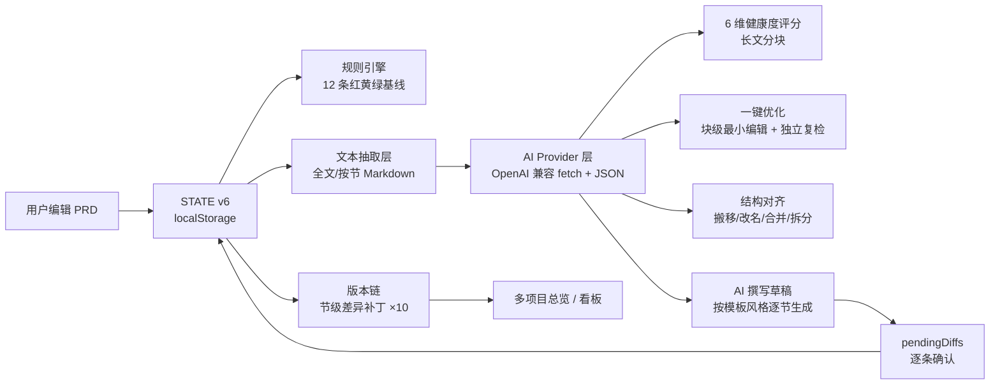

# 需求文档工作台 · 方案设计（整合版）

> 状态：**已实现至 v18.38** · 版本：v2.0 · 更新：2026-08-20
> 本文件为**唯一权威方案设计文档**，整合《AI 方案设计（v17.0）》《v17.1 方案设计（可信度）》《v17.2 方案设计（结构对齐 + 演进记录）》；旧文档已归档至 `archive/`。
> 配套：[交接文档](PRD智能看板_交接文档.md)（上手与运维）、[代码架构白皮书](PRD智能看板_代码架构白皮书.md)（代码级认知）。演进历史见 §12。

---

## 1. 产品定位与目标

**一句话**：本地优先、单文件、零网络的 PRD 撰写 + 健康度自检工具——把"写 PRD"从空白页变成"模板/描述 → 起草 → 体检 → 优化 → 评审"的完整闭环。

**目标用户**：产品经理 / 座舱等智能硬件产品/测试/研发；需要把 PRD 文档写规范、可量化、可验收的团队。

**核心价值**：

1. **撰写**：从零起草（AI 撰写草稿，可选手模板风格）→ 逐节续写/优化 → 版本可回滚；
2. **体检**：规则引擎即时红黄绿（免费离线）+ AI 6 维深度体检（按需联网深度）；
3. **看板**：单项目健康度热力图 / AI 总评 / 摘要一键复制，多项目总览横向对比；
4. **信任**：AI 提议、代码执行、人做决定——引用逐字校验、确定性校验、逐条确认、版本链精确回滚，杜绝幻觉污染交付物。

**设计原则**（贯穿全部迭代）：

- **可计算的交给代码，不可计算的才交给 AI**（确定性校验 > 模型判断）；
- **AI 提议、代码执行、人做决定**（所有写操作先入审阅清单，确认才生效）；
- **规则引擎永远可用**（无网/无 Key 时红黄绿基线不依赖 AI）；
- **先闭环、后扩展**（MVP 最小闭环，护栏先行，弱模型兼容兜底）。

---

## 2. 总体架构

**方案 C：纯前端直连（无后端）**。全部逻辑在一个自包含 HTML 中，AI 请求由浏览器直发 OpenAI 兼容服务（DeepSeek / 智谱 GLM-4-Flash 等）。



**文件结构（单文件，7 个 script 块）**：

| 块 | 位置（v17.24） | 职责 |
| --- | --- | --- |
| block0 theme-controller | ~802 | 浅色/深色/拟态主题 |
| block1 主脚本 | 1080–4434 | 状态/渲染/事件/表格/导入导出/模板/总览/示例 |
| block2 view-mode-controller | 4435 | 视图态「PRD 健康体检报告」横幅 |
| block3-4 Floating UI | ~4470 | 评论气泡定位（MIT 内联） |
| block5 comment-controller | 4489 | 划线评论/气泡/列表 |
| block6 ai-controller | 4749–7555 | AI 全部逻辑（评分/优化/对齐/撰写/分块/风格） |

**存储分层**：

| 键 | 内容 |
| --- | --- |
| `prdKanbanStateV3` | STATE（项目/框架/规则/预设/分组），JSON 备份导入导出的是它 |
| `prdKanbanStateV3.bak` | 5s 防抖自动备份 + 关闭前兜底；主键缺失自动恢复 |
| `prdKanbanAiSettings` | AI 设置（Base URL/模型/Key/目标分/轮数/维度权重/复检模型）——**永不进 STATE、不随备份导出** |
| `prdKanbanTheme` | 主题 |
| `prdKanbanTplCustom` | 自定义模板列表 `[{id,name,text,at}]` |
| `TPL_DRAFT_KEY` | 模板编辑区草稿（套用/生成前自动备份） |

---

## 3. 数据模型

```js
STATE = { version:6, density, seenWizard, projects:[Project], activeProjectId,
          groups, groupOpen, ruleSet:[Rule], framework:[Section], frameworkPresets:[Preset] }
Project = { id, name, groupId, data:{secId:SecData}, framework?, overrides, corrections,
            createdAt?, updatedAt?, autoGen?, ai? }
SecData = { html?, items?, rows?, colWidths?, rowHeights?, cards?, comments? }
Section = { id, title, type, required, weight, template }
// type ∈ text | table | feat | accept | users | timeline
Rule = { id, dim, desc, level:'red'|'yellow', weight, enabled, scope, threshold? }
```

- **DATA** = 当前激活项目的 `p.data` 引用（`refreshData()` 同步）；编辑直接改 DATA，`save()` 写回并落盘。
- **框架预设**（v17.23 起）：标准 PRD 14 节、精简 7 节两套（已移除「带小卡片 8 节」，`load()` 自动清理老数据残留）；另有「导入自动生成」「当前框架」「＋自建框架」。
- **AI 业务数据 `p.ai`**（随项目走、备份含）：`versions[] / lastReport / ignoredAiIssues[] / pendingDiffs / pendingAlign / scoreCache / lastOptDebug / lastGenDebug`。

---

## 4. 规则引擎（红黄绿基线）

- **12 条内置基线**（v16.3 冻结，设置页只读）：结构完整性（R-SPEC-01 必填节空=红）、规范合规、一致性（功能↔验收平衡、指标↔验证对应、埋点被提及）、可测性、风险冗余（P0 占比/范围蔓延/占位符）。
- **定位**：按「节类型 / 标题关键词」匹配，自定义框架、改过标题也能命中；不写死节 id。
- **人工审核通道**：下钻面板「忽略/已订正」+ 节色块「手动改色」永久保留，不因 AI 存在而消失。
- 完成度 = 必填节绿色占比；风险数 = 红节数；一致性问题数、人工覆盖数单独统计。
- **健康度颜色阈值**（v18.38）：完成度 ≥80 → 绿（良好）/ ≥60 → 黄（待完善）/ <60 → 红（风险）；存在红节时整体判红。顶部健康度胶囊、驾驶舱指标卡、多项目总览、AI 总评分色统一使用该阈值。

---

## 5. AI 能力设计

### 5.1 设置与 Key 隔离

- 设置页第 4 tab「AI」：Provider 预设（DeepSeek/OpenAI/自定义）、Base URL、模型、复检模型（可选）、API Key（password 掩码）、目标分（默认 85）、最大轮数（默认 3）、6 维开关与权重、测试连接（CORS/401/429/404/超时分类报错）。
- Key 只存 `prdKanbanAiSettings`，永不进 STATE / 备份 / 日志 / prompt；错误信息过滤 Authorization 头。

### 5.2 Provider 层

- `aiChatOnce`：OpenAI 兼容 `POST {base}/chat/completions`，支持流式（SSE 增量）与非流式；
- `aiAskJSON`：**非流式 + `response_format:json_object` 优先，流式兜底**（v17.13，弱模型更稳）；容错 JSON 提取（去围栏、括号配对）；请求分级 `max_tokens`；
- 错误分类与中文提示：401 Key 无效 / 429 限流退避重试 / 404 地址或模型 / 400 参数 / 超时 / 网络与 CORS；
- 全局中止：`aiGlobalAbort`（AbortController）+ `aiCancelFlag`，运行中「■ 停止」，中断不写入、可重试。

### 5.3 文本抽取

- `aiDocText / aiSecText`：按框架节输出 `## [节id] 标题 + 内容`（items/rows/cards 扁平化）；优化用 `noCards` 变体（模型不引用卡片文本，避免匹配失败）；
- 抽取结果仅用于请求，不落盘不进 STATE；表格转 Markdown 语法，图片剥离为占位。

### 5.4 深度体检（6 维评分）

- 维度：完整性 / 清晰度 / 一致性 / 可执行性 / 可验证性 / 风险（默认权重 25/20/15/15/15/10，可调）；总分本地加权计算（不信任 AI 总分）；
- **校准三件套**（v17.1）：temperature 0；每条 issue 带原文 `quote` + 维度 `note`，本地规范化匹配，未匹配标「⚠ 疑似幻觉」；内容指纹缓存（同文档零重复调用）；
- **长文分块评分**（v17.22）：全文 >5500 字按节切块（整节不切断）→ 逐块打分（maxTokens 4000）→ 各维度按内容长度加权聚合、问题跨块合并去重 → 摘要标注分块数 → 结果进缓存；
- 问题清单支持：定位跳转、忽略/已订正/恢复、点击下钻判分原因。

### 5.5 一键优化

- **范围**：全文 / 按节（弹窗选择）；**基线**：先深度体检；
- **最小编辑**（v17.1）：text 节块级 edits（replaceBlock/insertBlock/deleteBlock，`match` 逐字引用原文，未引用块一律不动；v17.7 支持连续多块范围匹配）；table 节行级 rowEdits（按首列定位）；items/cards 仅给建议文字；
- **整节/按节兜底**：模型返回整节 `newHtml/newRows` 自动降级整节替换；复杂协议空/全 blocked 时自动「简化整节重试」；整份超 2500 字直接按节逐个优化（v17.14）；整份解析失败按节兜底（v17.13）；
- **独立复检**（v17.1）：独立 prompt（可配 reviewModel），verdict pass/needs_work/fail + score；达标 = 复核分 ≥ 目标 且 verdict≠fail 且无 blocked；
- **确定性校验**：HTML 标签闭合 / 表格列数一致 / 引用逐字匹配 / 越界修改拦截（blocked 禁接受）；评论划线被覆盖仅警告；规则引擎前后对比（恶化仅警告）；
- **护栏**：目标分与轮数上限（2-5）；复检分数低于历史最好 → 自动保留最好版本；产出待确认 Diff，逐条接受/修改/拒绝/暂缓，**确认前正文零改动**；
- **诊断**：`p.ai.lastOptDebug` 记录模型返回条数/过滤原因/复核结论/兜底步骤/原始返回片段，面板可见可清除。

### 5.6 结构对齐（导入内容归位）

- **错位检测**（本地确定性信号）：兜底节占比 >25%、必填节空、单节块数异常 → 导入后 toast 提示；
- **自动搬移**：`moveBlock`（text 块，match 逐字）/ `moveRow`（表格行，列数一致校验）跨节搬移，锚点定位；校验不过 blocked 禁接受；
- **ops 自动调整**（v17.3）：rename（框架标题 fwname 补丁）、deleteEmpty（仅空且非必填）、merge（同类型）、split（text 节拆块到新节 fwadd）——框架级补丁可回滚；
- **确认**：复用 Diff 交互（接受/拒绝/暂缓/全部接受）；应用后生成「结构对齐」版本（双节补丁），**变换型版本恢复=撤销搬移**；
- **导入默认自动框架**（v17.3/17.4/17.5）：无项目/空项目导入按文档标题自动建节（目录跳过、层级保留、编号行不误判），并按标题关键词补必填语义（v17.17，修复导入文档完成度恒 100%）。

### 5.7 AI 撰写草稿（从零起草）

- **入口**：AI 面板「✍ AI 撰写」+ 无项目空态按钮 + 帮助引导直达；弹窗填项目名称/产品描述/框架（标准 14 / 精简 7 / 当前框架）/模板风格（不约束/标准/精简敏捷/智能硬件·车规）；
- **逐节生成**：新建空白项目 → 按框架逐节调用（text/timeline 返回 Markdown，本地 `aiMdToHtml` 转 HTML；table 返回 rows 列数校验；feat/accept/users 返回 items 字段归一：优先级 P0-P4、状态枚举、空条目过滤）；单节失败跳过并记录 `p.ai.lastGenDebug`，不中断整体；可「■ 停止」；
- **风格约束**（v17.19）：`aiGenStyleGuide(style)` 生成紧凑风格指南注入每节 prompt（车规含功能安全等级/故障降级/敏感指令二次确认/环境法规/接口协议/指标上下限）；
- **确认与写入**：产出进 `pendingDiffs`（`gen:true`，面板标题「AI 撰写草稿」），逐条接受/修改/拒绝/暂缓 + 全部接受；接受后 `replaceSection/replaceRows/replaceItems` 写正文；
- **回滚**：草稿版本 `transform:true`，「恢复」=回到生成前空白；恢复前自动存「恢复前快照」，恢复该快照可找回草稿。

### 5.8 多角色评审（v18.33）

- **5 角色人设**：产品经理（定位/目标/范围/优先级）、研发（技术可行性/成本/依赖）、测试（验收/覆盖/边界）、设计（交互/多模态一致性/反馈）、项目经理（排期/里程碑/风险/资源）；
- **评审流程**：勾选角色 → 逐角色调 AI 评审真实 PRD 内容（`rvFetchStream` 直连 OpenAI 兼容 API，流式 + 15s 空闲超时）→ 结果按 `- [high|medium|low] 意见（章节：xxx）` Markdown 格式解析归一；
- **结果展示**：按角色分组（严重级 pill + 意见 + 涉及章节），失败单角色降级为错误条目不中断整体；评审历史本机持久化（最多 20 条，可复看/删除/清空），支持跨项目评审；
- **架构说明**：`rvRun` 通过 `window.__AICtrl.getSettings()` 取配置、`__AICtrl._test.docText()` 取文档、直接 fetch 实现流式——绕过 ai-controller IIFE 抽象（该抽象只暴露任务级 API，不暴露底层 chat）。

### 5.9 深度思考（v18.36）

- **思考过程采集**：`aiChatOnce` 流式解析 `reasoning_content` / `reasoning` / `thinking` 字段（DeepSeek-R1 / 智谱 thinking / OpenAI 兼容全覆盖），经独立 `onReasoning` 回调传出，不污染正常输出；
- **可折叠思考块**：统一 `<details>` 组件（参考 Open WebUI / AI SDK / Streamlit R1 方案）——流式时自动展开 + **自动滚动到最新内容**（`aiScrollThinkBody`），完成后自动收起可手动翻阅；标题带字数统计，流式时黄色脉动点；
- **接入范围**：AI 对话（侧栏/浮动共用消息系统）、AI 设计对话（aiDesSend）、多角色评审（rvThinkHtml）全部统一。

### 5.10 全局 SVG 图标（v18.37）

- **ICONS 常量**（主 script 顶部）：20+ 线性描边 SVG（brain/check/x/warn/bolt/robot/clipboard/star/target/gear/flask/palette/cal/ban/up/refresh/upload/pencil + 大尺寸变体），界面零 emoji；
- **替换范围**：思考块/评审角色/状态徽章/空状态/工具栏按钮/富文本链接等全部 UI 图标；textContent 场景（状态栏/日志）去符号改纯文字；导出内容与解析格式符号保留。

---

## 6. 版本链（节级差异补丁）

- **为什么不用全文快照**：localStorage 5MB，10 个全文快照必爆；每版本只记「哪些节变了、变前变后逐字快照」；
- **补丁格式**：旧格式 `{old,new}` 整节；新格式数组 `[{kind:'block'|'row'|'section'|'rows'|'items', ...}]`（v17.1 块/行级、v17.15 新增 `items` 清单级），双格式兼容可查看/恢复；
- **恢复/回滚算法**：恢复前先写「恢复前快照」human 版本（任何恢复可再撤销）；从 head 倒序应用各版本补丁的 `old`（逐字快照，无 diff 演算、无累积误差）；目标版本自身落回 `new`；
- **变换型版本**（结构对齐/AI 草稿，`transform:true`）：恢复头部=撤销该次操作（搬回原位/清空草稿），与用户直觉一致；
- **上限**：10 版，超限自动淘汰最早非 final 并 toast；Final 不自动淘汰；大小护栏：单节 >100KB 剥离 data 图片、单版本 >300KB 提示导出备份；
- **人工增量兜底**：下次优化前自动对比版本记录生成 human 版本（旧格式）；新格式由「恢复前快照」兜底。

---

## 7. 模板库

- **内置内容模板**（v17.18）：标准 PRD 14 节 / 精简敏捷 PRD 7 节 / 智能硬件·车规——量化目标、验收可"是/否"判定、安全/环境/法规/接口提示、排除项防蔓延；
- **自定义模板**（v17.20）：模板弹窗「存为模板/删模板」，`prdKanbanTplCustom` 本地持久化，下拉「★ 名称（自定义）」；内置模板不可删；
- **AI 风格约束**（v17.19）：撰写弹窗「模板风格」把模板取舍注入生成 prompt（见 5.7）；
- **防误丢**：套用预设/重新生成前自动把编辑区内容备份到草稿（`TPL_DRAFT_KEY`）。

---

## 8. 看板与总览

### 8.1 单项目看板（v17.16）

- **hero 实时摘要**：完成度 / 风险红节 / AI 总评 / 更新时间；
- **节健康度热力图**：每节一个色块（绿/黄/红，GitHub 风格），悬停看节名状态，点击=定位并展开判分明细（下钻）；
- **AI 总评卡**：有报告显示总分 + 6 维迷你条 + 一句话总评；无报告给「运行深度体检」入口；
- **体检摘要一键复制**：Markdown（指标 + 逐节 emoji 状态 + 缺口清单），粘贴评审群；同卡附导出 MD。

### 8.2 多项目总览（v17.17）

- 侧栏「◫ 总览」浮层：统计头（项目数/平均完成度/有风险项目数/AI 总评数）+ 每项目健康卡（完成度/红节/AI 总评/逐节迷你色点/更新时间）；
- `healthForProject(p)`：try/finally 临时切换 framework/DATA/activeProjectId 跑 `runHealth()` 后恢复，**不污染当前项目状态**；
- **排序**（v17.20）：风险优先（红节在前再按完成度升序）/ 完成度升序 / 最近更新，循环切换；
- **切换**：点击卡片切换项目并关闭；⚠️ 切换必须先 `refreshData()` 再 `save()`（v17.24 修复：此前 save 会用上个项目 DATA 覆盖目标项目，真实数据丢失）。

### 8.3 视图态评审报告（block2）

- 「完成编辑」进入只读评审视图：hero 顶部「PRD 健康体检报告」横幅（生成日期/节数/风险红节/AI 总评/整体 verdict），打印样式适配。

---

## 9. 导入导出与格式支持

- **导入**：`.md/.markdown/.txt/.html/.docx`（自实现 zip 解析，加密检测）+ 粘贴；标题识别（`headingLevelOf` v17.4：目录样式排除、outlineLvl 0-8、加粗兜底排除封面行；v17.5：`###` 归入父节小卡片）；
- **导出**：MD、Word（自实现 OOXML，封面 + 表格 + 图片）、JSON 备份/恢复（全量 STATE，**不含 AI 设置/Key**）、规则与框架 JSON；
- **富文本表格列宽**（v17.21）：拖拽宽度落盘；行/列操作后新列继承相邻列宽、表头 `<th>`、新行复制列宽（修复 17px 挤扁）。

---

## 10. 交互与帮助

- **事件模型**：`data-act`/`data-ai` + document 委托（bindStatic / aiBind），新增按钮=加属性+加 case；
- **帮助入口**（v17.24）：引导移入「更多 ▾ → 帮助」（三步：能力总览/三种开始方式/小贴士），不再首启自动弹出；
- **顶栏收纳**（v17.25）：「设置 / 评论 / 框架」从顶栏按钮收进「更多 ▾」菜单（更多 = 设置 / 评论 / 框架 / 帮助 / PRD 模板 / 重置看板），顶栏只留 撤销 / 完成编辑 / 插入▾ / AI / 更多▾ / 导入▾ / 导出▾；评审视图保留 设置/评论/帮助，只藏 模板/重置/框架 等管理项；
- **撤销**：编辑类 `data-act` 入 `MUT` 快照栈（上限 40）；项目级操作永不入栈（v13 血泪教训）；
- **数据兜底**：输入即防抖落盘 + 5s 自动备份 + 主键缺失自动恢复 + 空项目给「恢复备份」一键入口。

---

## 11. 安全与数据边界

- Key 独立键、掩码回显、不导出、不进日志；`aiSanitizeHtml` 剥 script/style/iframe/on* 并校验 img/a 协议；
- localStorage 写满时顶部红色告警 + 一键导出备份（不静默丢数据）；
- 换浏览器/换路径数据按来源隔离，跨环境迁移用「导出/导入 JSON 备份」；
- 公开分享的轻应用链接不带任何人的 Key。

---

## 12. 演进历史（v17.0 → v17.24）

| 版本 | 要点 |
| --- | --- |
| v17.0 | AI 助手上线（方案 C）：设置页 AI tab、6 维评分、一键优化 Agent 工作流、Diff 逐条确认、节级补丁版本链 |
| v17.1 | 可信度升级：temperature 0、引用+幻觉标记、评分缓存、独立复检、确定性校验、块/行级最小编辑、双格式补丁 |
| v17.2 | 结构对齐：错位检测、moveBlock/moveRow 跨节搬移、变换型版本恢复；智谱 GLM-4-Flash 免费模型接入 |
| v17.3 | 停止按钮、导入默认自动框架、对齐 ops 自动执行（rename/deleteEmpty/merge/split + 框架级补丁） |
| v17.4 | 导入标题识别修复（真实案例 290→72 节）：目录排除、outlineLvl、加粗兜底收紧 |
| v17.5 | 侧栏可滚动、`###` 归父节小卡片、优化兼容整节返回、blocked 原因可见 |
| v17.6 | 优化兜底重试（简化整节协议）+ `lastOptDebug` 诊断可见 |
| v17.7 | 连续多块范围匹配、优化文本排除小卡片、全 blocked 自动整节重试 |
| v17.8 | AI 面板原文点击跳转（`aiJumpToBlock` 高亮） |
| v17.9 | 逐条接受即写入 + 单条撤销 |
| v17.10 | 数据自动备份与恢复（.bak / 恢复入口） |
| v17.11 | 新示例 PRD（智能座舱语音助手，自动框架导入） |
| v17.12 | 单个接受即时重绘正文 |
| v17.13 | 优化输出加固：非流式 json_object 优先、分级 max_tokens、整份失败按节兜底 |
| v17.14 | 大文档直接按节优化（>2500 字跳过整份） |
| v17.15 | **AI 撰写草稿**：描述→逐节生成整份 PRD，items 补丁，transform 回滚 |
| v17.16 | 看板总览升级：hero 摘要、节健康度热力图、AI 总评卡、摘要一键复制 |
| v17.17 | 多项目总览视图 + 自动框架必填语义修复 + 视图态横幅升级 |
| v17.18 | 模板库内容化（标准/敏捷/车规）+ 热力图下钻 |
| v17.19 | AI 撰写按模板风格约束生成 |
| v17.20 | 自定义模板存取 + 总览排序 |
| v17.21 | 富文本表格列宽持久化修复（行/列操作继承列宽） |
| v17.22 | 长文档分块评分 + 总览糊屏热修（浮层隐藏态缺失） |
| v17.23 | 新手引导焕新 + 移除「带小卡片 8 节」默认框架（含老数据迁移） |
| v17.24 | 引导移入「更多→帮助」、示例改标准 14 节、总览切换数据丢失修复 |
| v17.25 | 顶栏收纳：设置 / 评论 / 框架移入「更多」菜单（评审视图保留设置/评论/帮助） |
| v18.32 | 修复 AI 面板生成时/后关闭异常（清除 inline transform 副作用）+ 接受/拒绝后常驻绿/红状态色（已拒绝也可撤销） |
| v18.33 | **多角色评审接真实 AI**（5 角色按视角流式评审）+ 流式空闲超时（15s 无数据自动中断）+ 浅色模式接受/拒绝按钮颜色修复 |
| v18.34 | 修复评审 TDZ bug（`st` 早于 const 声明被引用） |
| v18.35 | 评审重构：`__AICtrl` + 直连 fetch 流式（绕过 IIFE 抽象）+ Markdown 结果解析 |
| v18.36 | **深度思考**可折叠组件全板块接入（流式自动展开 + 完成后可翻阅） |
| v18.37 | 全局 emoji → 线性 SVG + 深度思考自动下翻（思考到哪看到哪）+ 上线前 QA 通过 |
| v18.38 | 健康度阈值统一 ≥80 绿 + 方案设计文档整合（归档旧方案文档） |

---

## 13. 测试与验证体系

| 类型 | 文件 | 覆盖 |
| --- | --- | --- |
| node 回归 | `regress_v162~166`（17/26/17/13/12 断言） | 规则引擎/表格/撤销/评论/手柄等历史能力 |
| node 回归 | `regress_v170`（85 断言） | AI 评分/优化/对齐/ops/导入/示例 |
| node 回归 | `regress_v1715/1719/1722/1723`（22/7/8/3 断言） | AI 撰写/风格注入/分块评分/预设迁移 |
| 浏览器端到端 | `browser_check.mjs`（评论）、`browser_check_grid.mjs`（表格网格）、`browser_check_ai.mjs`（19）、`browser_check_gen.mjs`（6）、`browser_check_dash.mjs`（27）、`browser_check_rtbl.mjs`（5） | 真实 DOM/交互/数据完整性 |
| 截图基线 | `screenshot_ui.mjs` | 首页/看板/总览/模板/撰写/设置，深浅色 |

截至 v17.24：**210 项 node 断言 + 57 项浏览器断言全绿，控制台零报错**。浏览器脚本在受限沙箱内须以 PowerShell `Start-Process` 拉起 Edge/Chrome（`--no-sandbox --disable-breakpad --disable-crash-reporter --remote-allow-origins=*`）。

**上线前 QA（v18.37 起，脚本在 `.workbuddy/qa/`）**：

| 脚本 | 覆盖 |
| --- | --- |
| `qa-runtime.js`（jsdom） | 全 script 块真实执行、0 未捕获错误、DOM 结构完整性 |
| `qa-flow.js`（jsdom） | 加载示例→健康度、设置/版本号、评审 5 角色 + SVG 图标、无 Key 拦截、AI 面板渲染、浮动面板、导出 MD |
| `qa-regression.js` | 上次修复回归（流式超时/按钮颜色/TDZ/__AICtrl/深度思考滚动/SVG/版本号） |
| 静态分析（node 内联） | 8 script 块语法、132 data-act + 40 data-ai 事件分发全覆盖、getElementById ID 存在性、跨 IIFE 调用干净、XSS 转义抽查 |

---

## 14. 遗留与路线图（候选）

1. 独立复检（review）的长文档分块（当前评分已分块，复检仍单请求）；
2. 云端同步（薄代理 + 账号，突破 localStorage 边界）；
3. 总览分组折叠 / 跨项目 Diff 对比；
4. AI 撰写后自动跑一轮深度体检闭环；
5. 句子级文本手术（当前块级是最小可控单元）。

---

## 15. 关键设计决策记录

| 决策 | 理由 |
| --- | --- |
| 纯前端方案 C | 零部署、零账号成本；Key 只存本机 |
| 版本存节级补丁而非全文 | 5MB 上限 + 精确回滚（逐字快照，无 diff 演算） |
| items 清单补丁 | 撰写草稿的功能/验收/用户故事要能精确回滚 |
| 草稿/对齐版本 transform 语义 | 「恢复=撤销该操作」符合直觉；恢复前快照保证可再撤销 |
| 分块评分按节切、按长度加权 | 整节不切断保证上下文完整；弱模型长输出不截断 |
| 自动框架按标题补必填 | 修复导入文档"完成度恒 100%"的假信号 |
| 浮层默认隐藏（display:none） | 教训：全屏浮层必须有隐藏态，否则遮罩+模糊糊屏 |
| 总览切换先 refreshData 再 save | 教训：save 的 `p.data=DATA` 会把上个项目数据覆盖到目标项目 |
