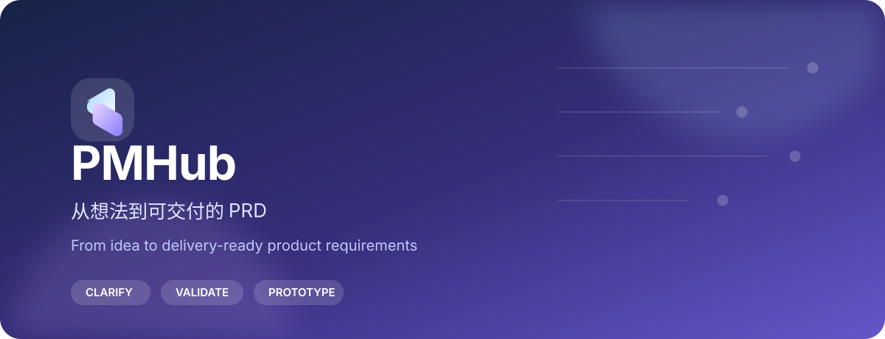

<p align="center">
  
</p>

<p align="center">
  <a href="https://wang1267.github.io/prd_assistant/"><strong>打开 PMHub / Open PMHub</strong></a>
  &nbsp;·&nbsp;
  <a href="#quick-start--快速开始">快速开始 / Quick start</a>
  &nbsp;·&nbsp;
  <a href="#privacy--数据边界">数据边界 / Privacy</a>
</p>

## 从想法到可交付的 PRD / From idea to a delivery-ready PRD

PMHub 是一个浏览器优先的产品需求工作台。它把零散想法整理为可编辑的 PRD，并帮助产品、设计、研发和测试在交付前对齐范围、验收标准和页面原型。

PMHub is a browser-first workspace for turning rough ideas into editable product requirements. It helps product, design, engineering, and QA align on scope, acceptance criteria, and visual page prototypes before delivery.

## 核心能力 / What you can do

| 需求澄清 / Clarify | 交付检查 / Validate | 页面原型 / Prototype |
| --- | --- | --- |
| 通过 AI 问答或模板将想法整理为结构化 PRD。<br><sub>Shape an idea into a structured PRD with guided AI prompts or templates.</sub> | 检查完整度、风险与一致性，输出可讨论的问题。<br><sub>Review completeness, risks, and consistency with actionable findings.</sub> | 从 PRD 创建、编辑并导出独立 HTML 页面原型。<br><sub>Create, edit, and export standalone HTML prototypes from a PRD.</sub> |

| 多角色评审 / Review together | 多种导出 / Export | 本地优先 / Local first |
| --- | --- | --- |
| 汇总产品、设计、研发和测试视角的意见。<br><sub>Bring product, design, engineering, and QA feedback into one review flow.</sub> | 导出 Markdown、Word、JSON 备份和原型 HTML。<br><sub>Export Markdown, Word, JSON backups, and prototype HTML.</sub> | 项目、模板和设置默认保存在当前浏览器。<br><sub>Projects, templates, and settings stay in the current browser by default.</sub> |

## 工作流 / Workflow

```text
Idea / 想法  →  PRD / 需求文档  →  Review / 评审  →  Prototype / 原型  →  Export / 交付
```

先从一句产品想法、现有 PRD 或场景模板开始；完成首稿后检查交付缺口，再进入原型工作区校准页面表达，最后导出交付物。

Start with an idea, an existing PRD, or a template. Check delivery gaps after the first draft, refine the page in the prototype workspace, then export what your team needs.

## Quick start / 快速开始

1. 打开[在线版](https://wang1267.github.io/prd_assistant/)，或下载完整仓库后打开 `PMHub.html`。无需构建或后端服务。<br>
   Open the [online app](https://wang1267.github.io/prd_assistant/), or download the full repository and open `PMHub.html`. No build step or backend is required.
2. 选择“从想法开始”、新建空白项目，或导入已有 PRD。<br>
   Start from an idea, create a blank project, or import an existing PRD.
3. 如需 AI，在“设置”中选择兼容服务并填写自己的配置。<br>
   To use AI, choose a compatible provider and enter your own configuration in Settings.

## Privacy / 数据边界

- PMHub 默认将项目数据保存在当前浏览器和站点地址下；换设备或地址时，请分别导出工作台的 PRD 备份和原型设置中的原型备份，再导入。<br>
  PMHub stores data per browser and site address. Before switching devices or addresses, export both the workspace PRD backup and the prototype backup from prototype Settings, then import them at the destination.
- AI 功能仅在你完成配置并确认发送范围后才会调用对应服务；API Key 仅保存在当前浏览器。<br>
  AI calls are made only after you configure a provider and confirm the data scope. API keys remain in the current browser.
- 原型导出为独立 HTML，不携带工作区编辑器、脚本或外部请求。<br>
  Exported prototypes are standalone HTML without workspace editor code, scripts, or external requests.

## Static hosting / 静态托管

发布静态站点时，请一并包含 `index.html`、`PMHub.html`、`assets/`、`src/` 和 `prototype/`。修改原型开发源后，运行：

```powershell
powershell -ExecutionPolicy Bypass -File tools/sync-prototype-runtime.ps1
```

For static hosting, publish `index.html`, `PMHub.html`, `assets/`, `src/`, and `prototype/` together. Run the command above after updating the prototype source.
